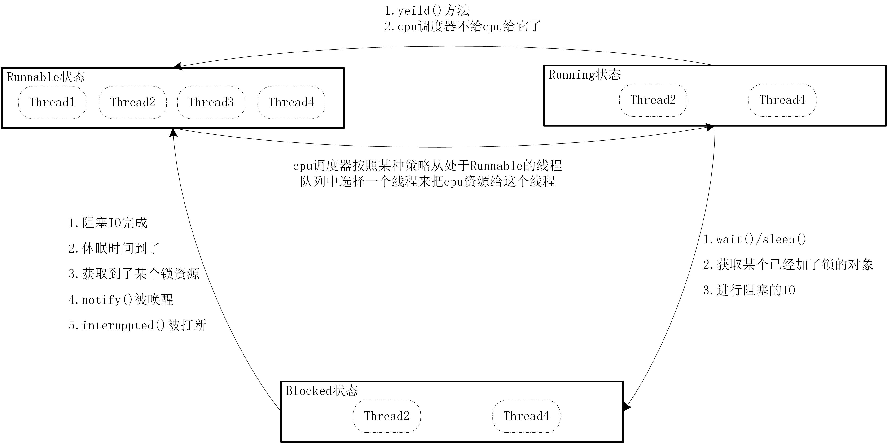

# 快速认识线程
###  1.线程的生命周期

###  2.Thread类的start方法
> public synchronized void start()
>
> ---解释--> 
>
> Causes this thread to begin execution; the Java Virtual Machine calls the run method of this thread.

在调用start方法的时候，首先会处理线程相关的逻辑事务，比如将线程从new状态转变为runnable状态，将线程加入到就绪队列中,然后再调用JNI的start0()，该方法先检查是否有runnable对象，如果有则调用该对象的run方法，如果没有则会调用自己所重写的run方法
```java
class Thread{
    public synchronized void start() {
        /**
         * This method is not invoked for the main method thread or "system"
         * group threads created/set up by the VM. Any new functionality added
         * to this method in the future may have to also be added to the VM.
         *
         * A zero status value corresponds to state "NEW".
         */
        if (threadStatus != 0)
            throw new IllegalThreadStateException();

        /* Notify the group that this thread is about to be started
         * so that it can be added to the group's list of threads
         * and the group's unstarted count can be decremented. */
        group.add(this);

        boolean started = false;
        try {
            // start0是一个JNI方法，会使得JVM调用类的run方法。
            start0();
            started = true;
        } finally {
            try {
                if (!started) {
                    group.threadStartFailed(this);
                }
            } catch (Throwable ignore) {
                /* do nothing. If start0 threw a Throwable then
                  it will be passed up the call stack */
            }
        }
    }

    private native void start0();
    // target是一个Runnable对象
    private Runnable target;
    @Override
    public void run() {
        // 如果传递给该类一个Runnable接口，则调用该对象的run方法。
        // 否则，Thread对象自己重写run方法
        // 都是重写runnable接口的run方法
        if (target != null) {
                target.run();
            }
        }
}
```
###  3.以下三种创建线程的联系和区别
```java
package yangyi.concurrency.charpter01;

public class TryConcurency{
    public static void main(String[] args){
        TicketWindow1 t11 = new TicketWindow1("类型1窗口1");
        TicketWindow1 t12 = new TicketWindow1("类型1窗口2");
        t11.start();
        t12.start();


        TicketWindow2 t21 = new TicketWindow2("类型2窗口1");
        TicketWindow2 t22 = new TicketWindow2("类型2窗口2");
        t21.start();
        t22.start();

        TicketWindow3 task = new TicketWindow3();
        Thread t31 = new Thread(task,"类型3窗口1");
        Thread t32 = new Thread(task,"类型3窗口2");
        t31.start();
        t32.start();
    }
}
class TicketWindow1 extends Thread{
    String name;
    public TicketWindow1(String name){
        this.name = name;
    }
    private int index = 1;
    private final int MAX = 50;
    @Override
    public void run(){
        while(index <= MAX){
            System.out.println(name + "卖：" + (index++));
        }
    }
}

class TicketWindow2 extends Thread{
    private String name;
    private static int index = 1; // 相比于TicketWindow1，此时在index面前加了index
    private final static int MAX = 50;
    public TicketWindow2(String name){
        this.name = name;
    }
    @Override
    public void run(){
        while(index <= MAX){
            System.out.println(name + "卖：" + (index++));
        }
    }
}
class TicketWindow3 implements Runnable{
    private int index = 1;
    private final static int MAX = 50;
    @Override
    public void run(){
        while(index <= MAX){
            System.out.println(Thread.currentThread() + "卖：" + (index++));
        }
    }
}
```
