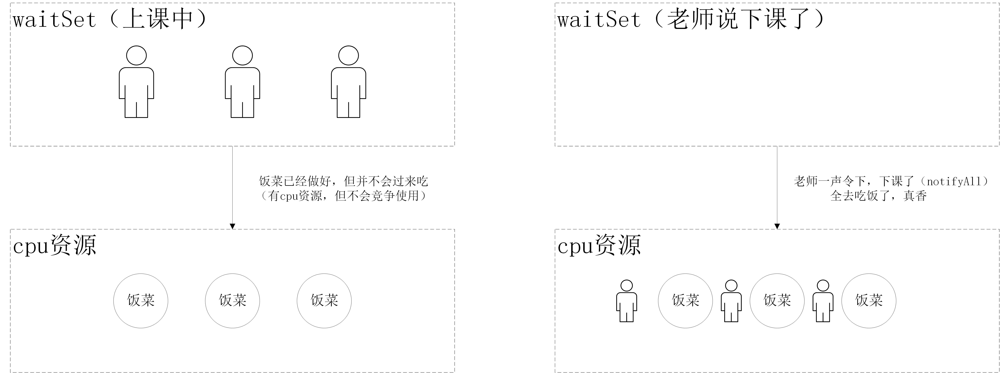

# Thread的wait()函数和notify()函数
wait()函数和notify()函数主要用于进程内部线程之间的通信
### java线程中的BLOCKED，WAITING，TIMED_WAITTING状态
##### 1 BLOCKED状态
当一个线程准备进入一个同步代码块的时候，等待获得对象的monitor lock（此时该对象的monitor lock被别的对象获取还没有被释放）的时候的状态称之为BLOCKED状态
##### 2 WAITING状态
当一个线程的执行单元调用不带参数的Object对象的wait(),Thread对象的join()方法时，线程进入WAITING状态状态
##### 3 TIMED_WAITING状态
当一个线程的执行单元调用带参数的Object对象的wait(),Thread对象的join()，sleep()方法时，线程进入TIMED_WAITING状态状态
##### 区别与联系
1. 三种状态都将导致线程释放cpu资源
2. 三种状态重新获得cpu资源的时机不同（得到cpu资源，不意味获得了monitor lock）

##### demo
```java
// sleep()方法不会释放monitor lock, wait()方法会释放monitor lock
public class Entry{
    public static void sleep(int seconds){
        try{
            TimeUnit.SECONDS.sleep(seconds);
        } catch (InterruptedException e){
            e.printStackTrace();
        }
    }
    public static void main(String[] args){
        Object x = new Object();
        Thread t1 = new Thread(() ->{
            synchronized(x){
                try{
                    // 会释放monitor lock
                    x.wait(5000);
                } catch (InterruptedException e){
                    e.printStackTrace();
                }
            }
        });
        Thread t2 = new Thread(()->{
            synchronized(x){
                Entry.sleep(5);
            }
        });
        // 进入TIMED_WATTING状态，并且释放锁
        t1.start();
        Entry.sleep(1);
        // 获得锁，并且进入TIMED_WATTING状态
        t2.start();
        System.out.println(t1.getState());
        System.out.println(t2.getState());
    //    输出
    //    TIMED_WAITING 
    //    TIMED_WAITING
    }
}


public class Entry{
    public static void sleep(int seconds){
        try{
            TimeUnit.SECONDS.sleep(seconds);
        } catch (InterruptedException e){
            e.printStackTrace();
        }
    }
    public static void main(String[] args){
        Object x = new Object();
        Thread t1 = new Thread(() ->{
            synchronized(x){
                // 获得monitor lock，睡觉去了，不释放monitor lock
                Entry.sleep(5);
            }
        });
        Thread t2 = new Thread(()->{
            synchronized(x){
                Entry.sleep(5);
            }
        });
        t1.start();
        Entry.sleep(1);
        // 等待获得monitor lock
        t2.start();
        System.out.println(t1.getState());
        System.out.println(t2.getState());
        
//        输出
//        TIMED_WAITING
//        BLOCKED
    }
}
```

### wait()函数
1. wait方法必须要拥有monitor lock，所以wait方法要在同步方法中执行
2. wait方法释放cpu资源的同时也会释放对应的monitor lock
3. wait方法可以通过被其他线程唤醒和设定一定时间自动唤醒的方式来重新去竞争cpu资源（**不意味着获得对应的monitor lock**）
##### demo
```java
public class Entry{
    public static void sleep(int seconds){
        try{
            TimeUnit.SECONDS.sleep(seconds);
        } catch (InterruptedException e){
            e.printStackTrace();
        }
    }
    public static void main(String[] args){
        Object x = new Object();
        Thread t1 = new Thread(() ->{
            synchronized(x){
                try{
                    x.wait();
                } catch (InterruptedException e){
                    e.printStackTrace();
                }
            }
        });
        Thread t2 = new Thread(()->{
            synchronized(x){
                try{
                    x.wait();
                } catch (InterruptedException e){
                    e.printStackTrace();
                }
            }
        });
        Thread t3 = new Thread(()->{
           synchronized (x){
               try{
                   x.wait();
               } catch (InterruptedException e){
                   e.printStackTrace();
               }
           }
        });
        t1.start();
        t2.start();
        t3.start();
        Entry.sleep(1);
        System.out.println(t1.getState());
        System.out.println(t2.getState());
        System.out.println(t3.getState());

//        输出,并没有出现BLOCKED状态
//        WAITING
//        WAITING
//        WAITING
    }
}
```

### notify()函数
> waitSet里面存放的是由于wait方法而导致线程进入WAITTING状态的线程
1. 唤醒waitSet中的一个线程，使得被唤醒的线程去重新竞争cpu资源（若waitSet为空，则什么也不做）
> waitSet中的线程即使有cpu资源也不会去使用，被唤醒后就会竞争cpu了。
>
> 注意：线程虽然被唤醒会去竞争cpu了，即使竞争到了cpu资源，但并不代表就能立即运行，因为还需要monitor lock。

### notifyAll()函数
1. 唤醒waitSet中所有线程，使用这些线程全都会去竞争cpu资源（食堂开放的感觉）



### 生产者与消费者
### 自定义锁BooleanLock

