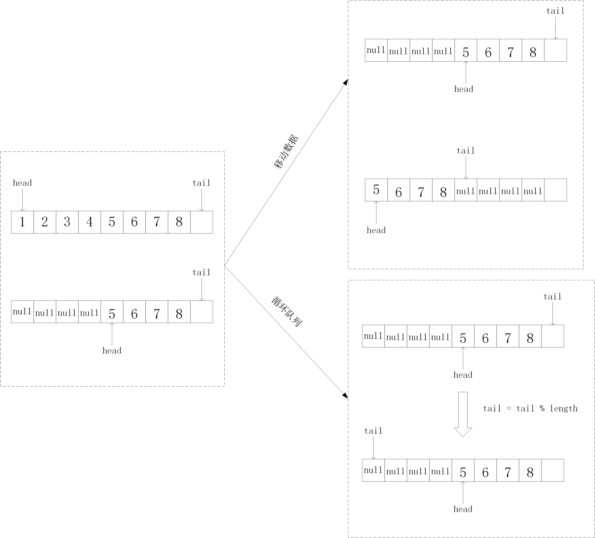

# 数据结构之队列
## 概念
#### 定义：队列是一种受的线性表，拥有先进先出的特点

#### 实现：数据存储结构（数组或者链表） + 头索引（头指针） + 尾索引（指针） 

#### 数据存储结构为数组和为链表时的主要区别：
1. 当数据存储结构为数组时，队列的存储大小有限； 当数据存储结构为链表时，队列的存储大小可以无限大

#### 应用场景： 对于某一有限资源（线程池，连接池），当资源不够用时，可以用队列来将过多的资源存储起来，因为队列先进先出的特点，可以使得过多的请求公平的访问资源。

## 实现
以数组为基本数据存储结构时的队列

当使用最基本的实现方式时，发现此时会出现伪空队列的情况，即数组中还有多有的存储空间，但程序确判断为满了。 针对伪空的问题，有提出了两种解决办法：
1. 移动数据
2. 循环队列（好）

由于移动数据将会导致内存中大量数组的变动，导致性能下降，所以一般会选择使用循环队列的方式。

### 最基本的实现方式


```java
class Queue{
    private int capacity;
    private int head=0;
    private int tail=0;
    String[] queue;
    public Queue(int cap){
        this.capacity = cap;
        queue = new String[cap];
    }
    public boolean inQueue(String x){
        if(tail == capacity){
            return false;
        }
        queue[tail++] = x;
        return true;
    }
    public String deQueue(){
        if(head == tail){
            return null;
        }
        String tmp = queue[head];
        queue[head] = null;
        head++;
        return tmp;
    }
}
```
如上图和代码所示，采用这种方式时，会出现队列没有空，但程序确判断为空的伪空情况
### 伪空解决之移动数据

```java
class Queue{
    private int capacity;
    private int head=0;
    private int tail=0;
    String[] queue;
    public Queue(int cap){
        this.capacity = cap;
        queue = new String[cap];
    }
    public boolean enQueue(String x){
        if(tail == capacity){
            // 栈真的满了
            if(head == 0){
                return false;
            }
            // 栈是假的满了
            else{
                // 移动一下数据
                for(int i=0; i<tail-head; i++){
                    queue[i] = queue[head+i];
                }
            }
        }
        tail = head;
        head = 0;
    }
    public String deQueue(){
        if(head == tail){
            return null;
        }
        String tmp = queue[head];
        queue[head] = null;
        head++;
        return tmp;
    }
}
```

### 伪空解决之循环队列
```java
class Queue{
    private int capacity;
    private int head=0;
    private int tail=0;
    String[] queue;
    public Queue(int cap){
        this.capacity = cap;
        queue = new String[cap];
    }
    public boolean inQueue(String x){
        if((tail + 1)%capacity == head){
            return false;
        }else{
            queue[tail] = x;
            // 循环
            tail = (tail + 1) % capacity;
            return true;
        }
    }
    public String deQueue(){
        if(head == tail){
            return null;
        }
        String tmp = queue[head];
        queue[head] = null;
        // 循环
        head = (head + 1) % capacity;
        return tmp;
    }
}
```


## 疑问
1. 什么是阻塞队列？有什么好处？阻塞队列会导致线程安全问题？
2. 为什么并发队列是线程安全队列？Disruptor?
3. Disruptor? cas? ArrayBlockQueue?