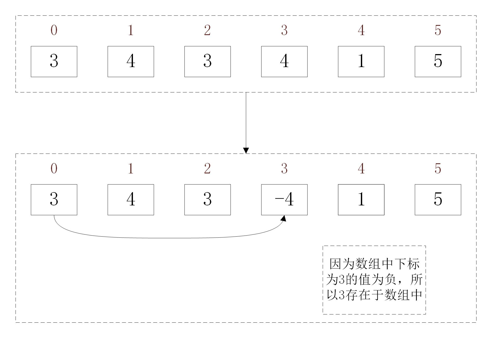

# 算法之第一个无重复最小正整数
## 描述
## 分析
1. 这个所要找的最小正整数的范围一定是在[1, n+1]之间。
2. 用数组的下标作为key， 数组的值作为value。

## 算法
0. 判断1是否有可能性
1. 把数组中所有小于0或者大于n+1的数，变为1（因为这些数字变为1了，所以数字1要特殊考虑, 所以放在初始化的时候判断是否为1）
2. 遍历数组，读到值为a时，则将第a个元素的值加个负号
注：重复情况不考虑，以及第n个值，存放在下标为0的位置
3. 遍历数组，如果数组的值大于0，则返回数组的下标。（如果数组的值小于0，则表明当前下标的值已经存在数组中）
## 代码