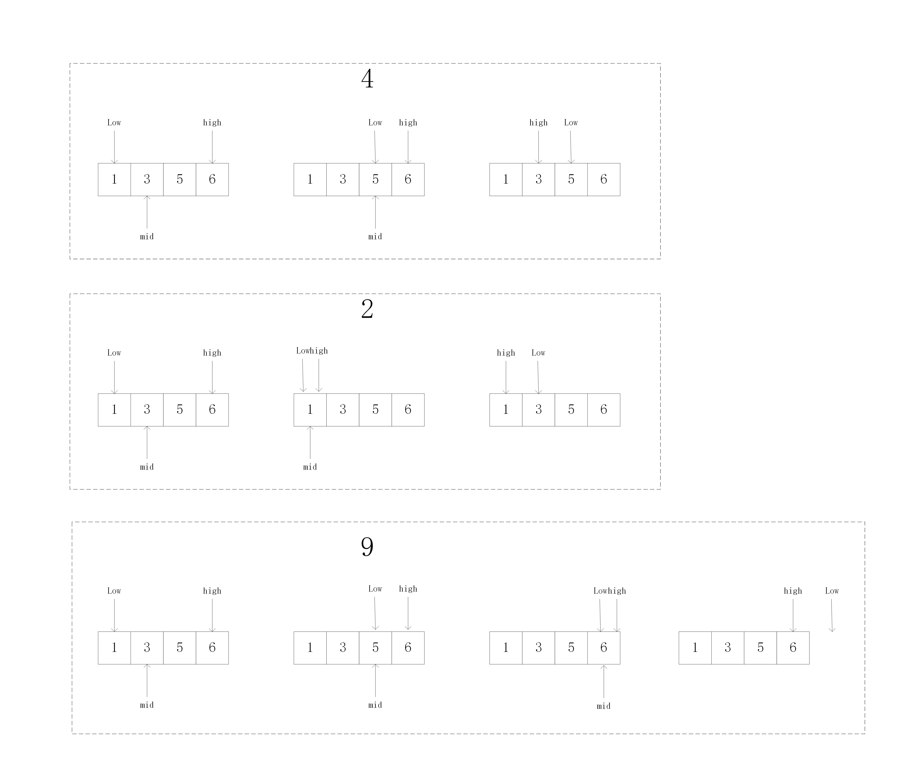

# 算法之插入搜索位置
## 描述
给定一个排序数组和一个目标值，在数组中找到目标值，并返回其索引。如果目标值不存在于数组中，返回它将会被按顺序插入的位置。

你可以假设数组中无重复元素
## 分析
二分法
## 思路
1. 二分法的关键点在于low，high指针，以及终止条件while(low<=high)
2. 有序数组中目标元素未出现时，返回插入的下标是一个小难点，经过举例分析得，返回的下标就是while循环终止时，low指针的位置

## 代码
```java
class Solution {
    public int searchInsert(int[] nums, int target) {
        int low=0,high=nums.length-1;
        int mid = (low + high)/2;
        int ans=0;
        while(low<=high){
            mid = (low + high) / 2;
            if(nums[mid] == target){
                ans = mid;
                return ans;
            }else{
                if(nums[mid] > target){
                    high = mid - 1;
                }else{
                    low = mid + 1;
                }
            }
        }
        return low;
    }
}
//  输入: [1,3,5,6], 5
//  输出: 2
```