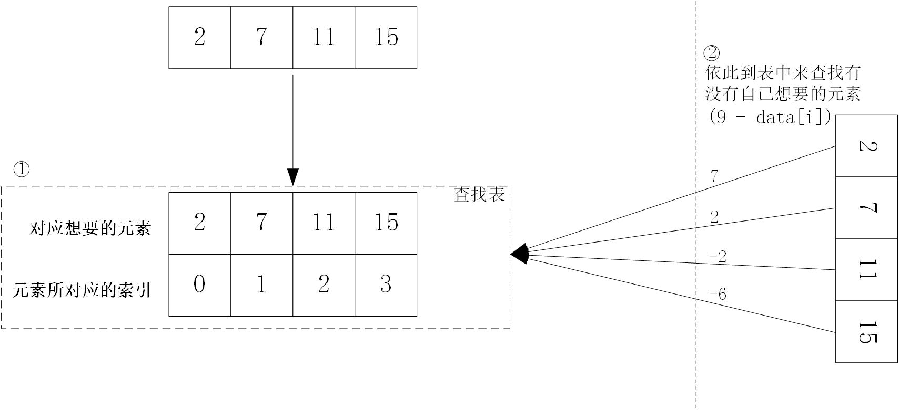

# 算法之两数之和
## 描述
给定一个整数数组 nums 和一个目标值 target，请你在该数组中找出和为目标值的那 两个 整数，并返回他们的数组下标。

你可以假设每种输入只会对应一个答案。但是，你不能重复利用这个数组中同样的元素。

## 思路
(一) 枚举法

枚举所有可能，然后从中选择满足条件的

(二) 查找法

1. 构建哈希表
2. 数组中每个元素依此在哈希表中找有有没有自己所需要的元素，若有则返回对应的下标
 
 
## 代码
```java
class TwoSum{
    public int[] twoSum(int[] nums, int target){
        HashMap<Integer, Integer> map = new HashMap<Integer, Integer>();
        int find;
        for(int i=0; i<nums.length; i++){
            map.put(nums[i], i);
        }
        for(int i=0; i<nums.length; i++){
            find = target - nums[i];
            if(map.containsKey(find) && map.get(find) != i){
                return new int[] {i, map.get(find)};
            }
        }
        throw new IllegalArgumentException("no");
    }
}
```
## 关键点
1. 利用了哈希表以近似时间复杂度为O(1)的速度进行快速查找的特点