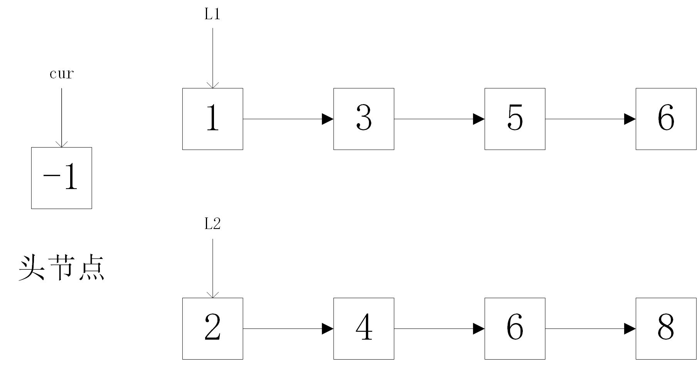

# 算法合并两个有序列表
## 描述
将两个有序链表合并为一个新的有序链表并返回。新链表是通过拼接给定的两个链表的所有节点组成的。
## 分析
略
## 思路
关键就是定义一个cur指针
> 注 手动定义一个头节点将大大减少代码行数


## 代码
```java
/**
 * Definition for singly-linked list.
 * public class ListNode {
 *     int val;
 *     ListNode next;
 *     ListNode(int x) { val = x; }
 * }
 */
class Solution {
    public ListNode mergeTwoLists(ListNode l1, ListNode l2) {
        // 特殊情况考虑
        if(l1 == null){
            return l2;
        }
        if(l2 == null){
            return l1;
        }
        if(l1 == null && l2 == null){
            return null;
        }
        // 定义两个位置变量，head用于指向头，cur用于指向插入位置的前一个位置
        ListNode head, cur;
        // 初始化
        if(l1.val >= l2.val){
            head = l2;
            cur = l2;
            l2 = l2.next;
        }else{
            head = l1;
            cur = l1;
            l1 = l1.next;
        }
        // while(l1 != null || l2 != null)
        while(l1 != null && l2 != null){
            if(l1.val < l2.val){
                cur.next = l1;
                cur = cur.next;
                l1 = l1.next;
            }else{
                cur.next = l2;
                cur = cur.next;
                l2 = l2.next;
            }
        }

        if(l1 != null){
            cur.next = l1;
        }else{
            cur.next = l2;
        }
        return head;
    }
}
```
```java
/**
 * Definition for singly-linked list.
 * public class ListNode {
 *     int val;
 *     ListNode next;
 *     ListNode(int x) { val = x; }
 * }
 */
// 相比于上面一个代码，大大减少了代码量，而关键就是自己手动定义了一个头节点
class Solution {
    public ListNode mergeTwoLists(ListNode l1, ListNode l2) {
        // 人工定义一个头节点
        ListNode head = new ListNode(-1);
        ListNode cur = head;
        while(l1 != null && l2 != null){
            if(l1.val < l2.val){
                cur.next = l1;
                cur = l1;
                l1 = l1.next;
            }else{
                cur.next = l2;
                cur = l2;
                l2 = l2.next;
            }
        }
        cur.next = l1 != null ? l1 : l2;
        return head.next; 
    }
}
```