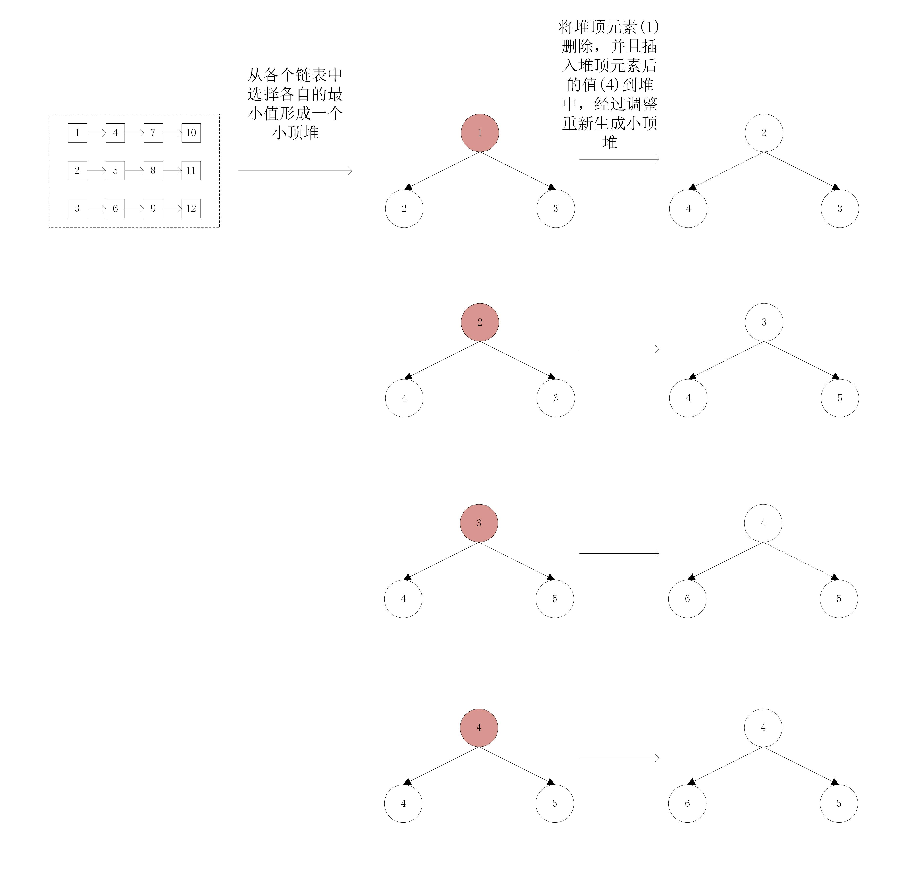

# 算法之合并k个有序链表
## 描述
## 分析
（一） 优先级队列（堆）来实现
（二） 分治算法来实现
## 思路
（一）优先级队列

（二）分治算法

略
## 代码
```java
//优先级队列
class Solution {
    public ListNode mergeKLists(ListNode[] lists) {
        if (lists == null || lists.length == 0) return null;
        PriorityQueue<ListNode> queue = new PriorityQueue<>(lists.length, new Comparator<ListNode>(){
            @Override
            public int compare(ListNode n1, ListNode n2){
                if(n1.val < n2.val){
                    return -1;
                }else{
                    return 1;
                }
            }
        });
        ListNode dummy = new ListNode(-1);
        ListNode p = dummy;
        ListNode tmp;
        // 初始化入队
        for(ListNode node: lists){
            if(node == null) continue;
            queue.offer(node);
        }
        // 队列为空的时候结束循环
        while(!queue.isEmpty()){
            tmp = queue.poll();
            p.next = tmp;
            p = p.next;
            if(tmp.next != null) queue.offer(tmp.next);
        }
        return dummy.next;
    }
}
```

## 总结
1. lists数组为空和lists有元素，但元素的值为null是两种情况
2. 优先级队列相关api--offer，poll