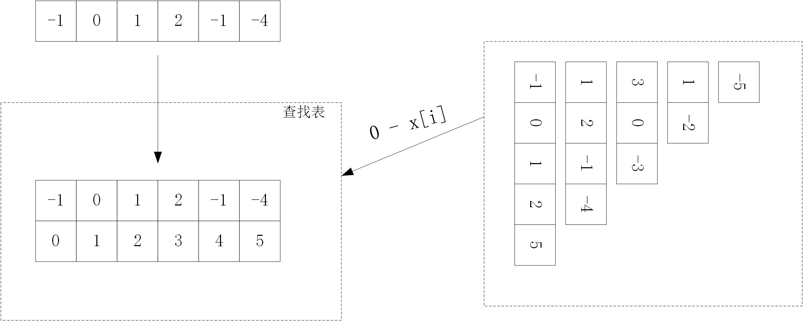
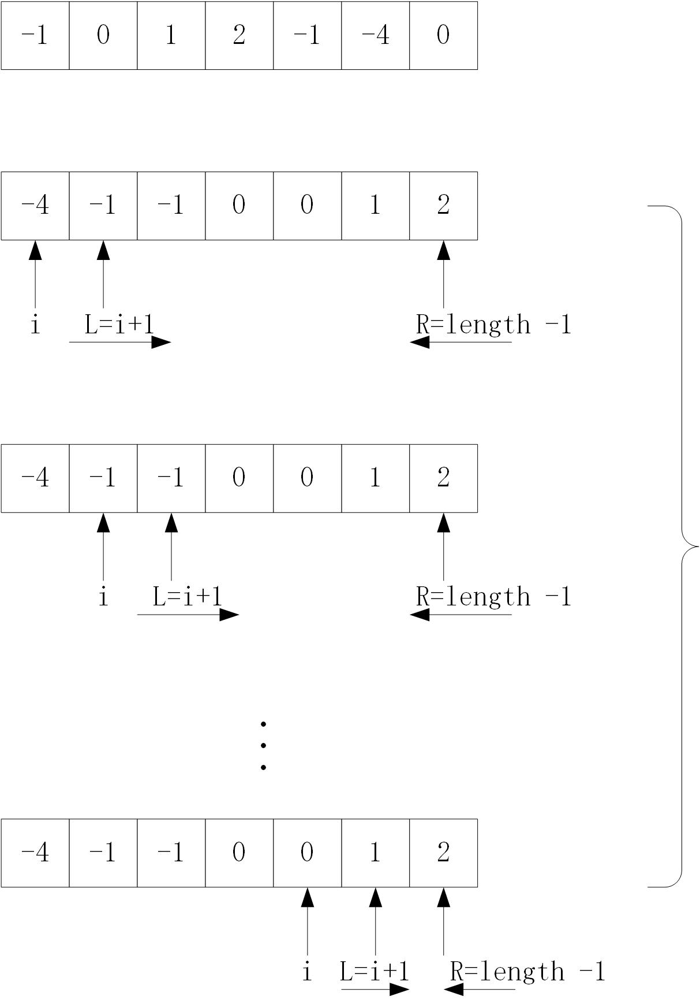

# 算法之三数之和
## 描述
给定一个包含 n 个整数的数组 nums，判断 nums 中是否存在三个元素 a，b，c ，使得 a + b + c = 0 ？找出所有满足条件且不重复的三元组。

## 思路
（一）查找法
1. 构建查找表
2. 计算两个数相加的所有可能的情况
3. 在2的基础上，从1中需要2所需要的值(下标不能相同)



(二)排序 + 双指针的法
1. 排序
2. 选择数组中一个位置，以及数组中这个位置后最左边和最右边的两个位置
3. 判断三个位置的和，如果小了，最左边的位置向右移动；如果大了，最右边的位置向做移动；如果等于0，则左右位置都移动一位
4. 重复2-3，直到遍历到数组中倒数第3个位置。

重复情况：
1. 如果nums[i] == nums[i+1],则重复，跳过；
2. 如果sum==0，nums[L] == nums[L+1], 则重复，跳过；
3. 如果sum==0，nums[R] == nums[R-1], 则重复，跳过；



## 代码
（一）查找法
```java
class Test{
    public List<List<Integer>> threeSum(int[] nums) {
        List<List<Integer>> res = new ArrayList<>();
        HashMap<Integer, Integer> map = new HashMap<>();
        int find;
        for(int i=0; i<nums.length; i++){
            map.put(nums[i], i);
        }
        for(int i=0; i<nums.length; i++){
            for(int j=i+1; j<nums.length; j++){
                find = 0 - nums[i] - nums[j];
                if(map.containsKey(find) && map.get(find) != i && map.get(find) != j){
                    res.add(Arrays.asList(nums[i], nums[j], find));
                }
            }
        }
        // 结果怎么去重呢？
        // [[-1,0,1],[-1,1,0],[-1,2,-1],[-1,-1,2],[0,1,-1],[0,-1,1],[1,-1,0]]
        // [[-1,-1,2],[-1,0,1]]
        return res;
    }
}
```
(二)排序 + 双指针法
```java
class Test{
    public List<List<Integer>> threeSum(int[] nums) {
        List<List<Integer>> res = new ArrayList<>();
        // 排好序了，从小到大
        Arrays.sort(nums);
        int L, R;
        int pre=-1000;
        for(int i=0; i<nums.length-2; i++){
            if(nums[i] > 0){
                break;
            }
            if(pre == nums[i]){
                continue;
            }
            L = i+1;
            R = nums.length - 1;
            while(L < R){
                if(nums[i] + nums[L] + nums[R] == 0){
                    res.add(Arrays.asList(nums[i], nums[L], nums[R]));
                    L++;
                    R--;
                } else if(nums[i] + nums[L] + nums[R] > 0){
                    R--;
                }else{
                    L++;
                }
            }
            pre = nums[i];
        }
        // 去重没解决
        // 程序结果：[[-1,-1,2],[-1,0,1],[-1,0,1]]
        // 正确结果：[[-1,-1,2],[-1,0,1]]
        return res;
    }
}
```
## 关键点