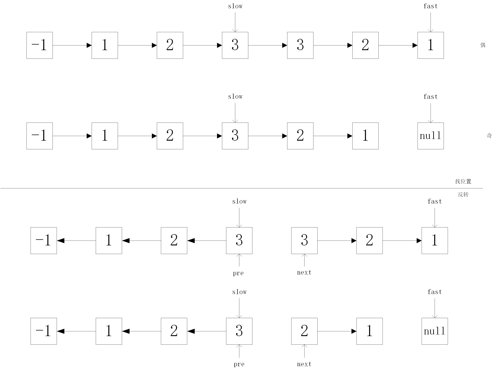

# 算法之回文链表
## 描述
请判断一个链表是否为回文链表。
## 分析
1. 快慢指针找位置，并且判断奇偶数
2. 反转部分链表
3. 判断是否是回文
## 思路
1. 快慢指针找位置，并且判断奇偶数
2. 反转部分链表
3. 判断是否是回文
## 代码
```java
class Solution {
    public boolean isPalindrome(ListNode head) {
        // 特殊情况考虑
        if(head == null || head.next == null){
            return true;
        }
        // 初始化工作
        ListNode dummy = new ListNode(-1);
        dummy.next = head;
        ListNode slow = dummy.next;
        ListNode fast = dummy.next.next;
        // 寻找中间节点
        while(fast != null && fast.next != null){
            slow = slow.next;
            fast = fast.next.next;
        }
        // 链表的反转
        ListNode pre = null;
        ListNode next = null;
        while(pre != slow){
            next = head.next;
            head.next = pre;
            pre = head;
            head = next;
        }

        // 奇数判断
        if(fast == null) pre = pre.next;
        while(pre != null && next != null){
            if(pre.val != next.val){
                return false;
            }
            pre = pre.next;
            next = next.next;
        }
        return true;
    }
}
```
## 总结
1. 有快慢指针，反转链表的基础
2. 动笔找规律

