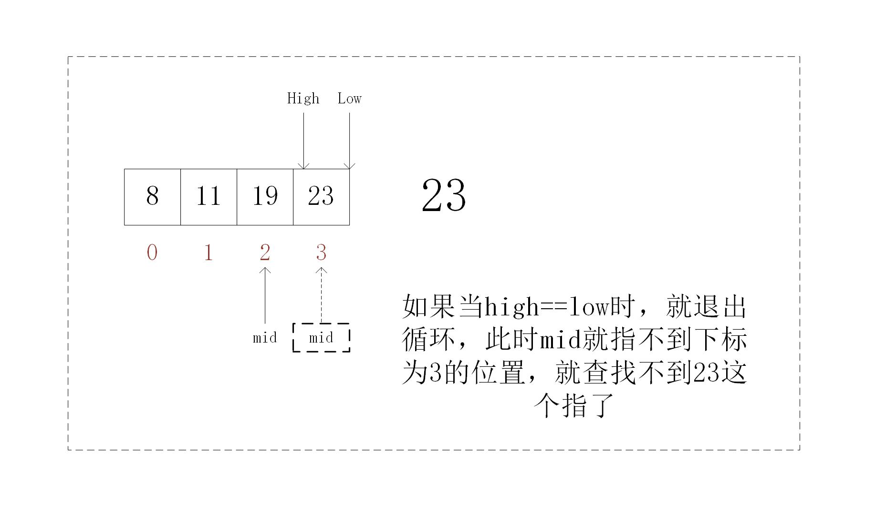
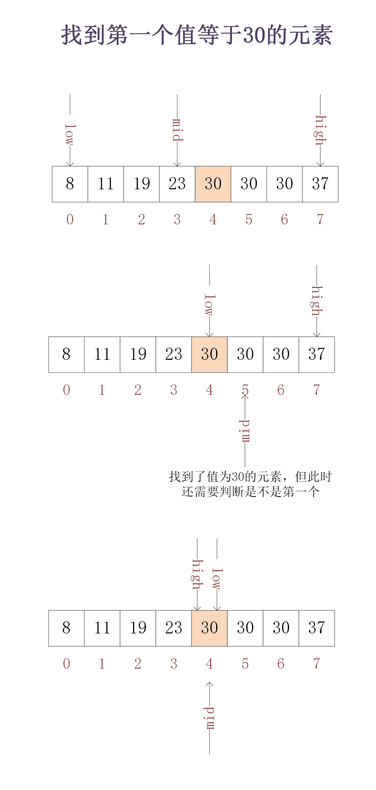
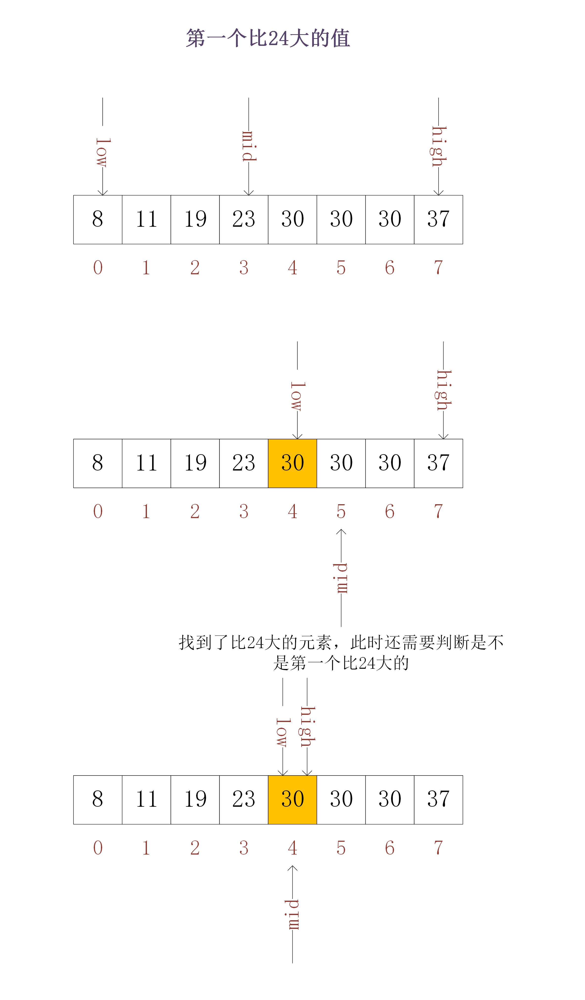

# 算法之二分查找
## 定义： 从**有序**的**数组**中以二分法的方式查找是否存在一个元素
> 注:定义中有两个非常强的限制条件:
> 1. 必须是有序的
> 2. 要用数组存储
## 优点
1. 非常快，时间复杂度是O(logn)。这意味着从一个长度为2的32次方的数组（4294967296个元素）查找一个目标值，仅需要比较32次就能得出结果。
1. 二分查找依赖于用数组存储数据，更具体的说，是利用了数组利用下标随机访问的特性。
## 缺点
1. 二分查找要求数组是有序的。这意味着数组有增删改等操作时，需要重新排序，这将非常耗时。所以二分查找适用于对数组改动较小的场景中
2. 数据量过大时，二分查找不合适。因为数据量过大导致系统分配不了那么多连续的内存空间（因为用数组存储）


## 代码
### 数组元素无重复

```java
class Test{
    public boolean binearSearch(int nums[], int target){
        int mid, low, high;
        low = 0;
        high = nums.length - 1;
        Arrays.sort(nums);
        // 注意：此处需要等号，当有等号时，mid可以取到下标为high（low）的值，若没有等会将会取不到该值，就会出现漏找的情况
        while(low <= high){
            // 取中间值可以优化
            // mid = low + ((high - low) >> 1);
            mid = (low + high) / 2;
            if(nums[mid] == target){
                return true;
            }else if(nums[mid] > target){
                high = mid - 1;
            }else if(nums[mid] < target){
                low = mid + 1;
            }
        }
        return false;
    }
}
```
### 数组元素有重复
#### 查找第一个值等于给定元素的值

```java
class Test{
    public int binearSearch(int nums[], int target){
        int mid, low, high;
        low = 0;
        high = nums.length - 1;
        Arrays.sort(nums);
        // 此处需要等号，当有等号时，mid可以取到下标为high（low）的值，若没有等会将会取不到该值，就会出现漏找的情况
        while(low <= high){
            // 取中间值可以优化
            // mid = low + ((high - low) >> 1);
            mid = (low + high) / 2;
            if(nums[mid] == target){
                if(mid == 0){
                    return mid;
                }
                if(nums[mid-1] == target){
                    high = mid - 1;
                }else{
                    return mid;
                }
            }else if(nums[mid] > target){
                high = mid - 1;
            }else if(nums[mid] < target){
                low = mid + 1;
            }
        }
        return -1;
    }
}
```
#### 查找最后一个值等于给定元素的值
```java
class Test{
    public int binearSearch(int nums[], int target){
        int mid, low, high;
        low = 0;
        high = nums.length - 1;
        Arrays.sort(nums);
        // 此处需要等号，当有等号时，mid可以取到下标为high（low）的值，若没有等会将会取不到该值，就会出现漏找的情况
        while(low <= high){
            // 取中间值可以优化
            // mid = low + ((high - low) >> 1);
            mid = (low + high) / 2;
            if(nums[mid] == target){
                if(mid == nums.length - 1){
                    return mid;
                }
                if(nums[mid+1] == target){
                    low = mid + 1;
                }else{
                    return mid;
                }
            }else if(nums[mid] > target){
                high = mid - 1;
            }else if(nums[mid] < target){
                low = mid + 1;
            }
        }
        return -1;
    }
}
```
#### 查找第一个大于等于给定值的元素

```java
class Test{
    public int binearSearch(int nums[], int target) {
        int mid, low, high;
        low = 0;
        high = nums.length - 1;
        Arrays.sort(nums);
        // 此处需要等号，当有等号时，mid可以取到下标为high（low）的值，若没有等会将会取不到该值，就会出现漏找的情况
        while (low <= high) {
            // 取中间值可以优化
            // mid = low + ((high - low) >> 1);
            mid = (low + high) / 2;
            if (nums[mid] > target) {
                if(mid == 0){
                    return mid;
                }
                if (nums[mid - 1] > target) {
                    high = mid - 1;
                } else {
                    return mid;
                }
            } else {
                low = mid + 1;
            }

        }
        return -1;
    }
}
```
#### 查找最后一个小于等于给定值的元素
```java
class Test{
    public int binearSearch(int nums[], int target) {
        int mid, low, high;
        low = 0;
        high = nums.length - 1;
        Arrays.sort(nums);
        // 此处需要等号，当有等号时，mid可以取到下标为high（low）的值，若没有等会将会取不到该值，就会出现漏找的情况
        while (low <= high) {
            // 取中间值可以优化
            // mid = low + ((high - low) >> 1);
            mid = (low + high) / 2;
            if (nums[mid] <= target) {
                if(nums[mid+1] <= target){
                    low = mid + 1;
                }else{
                    return mid;
                }

            } else {
                high = mid - 1;
            }
        }
        return -1;
    }
}
```
> 有重复二分查找第一个（最后一个）的时候，就是在查找到指定元素的基本上，再进一步的判断是否是第一个或是最后一个