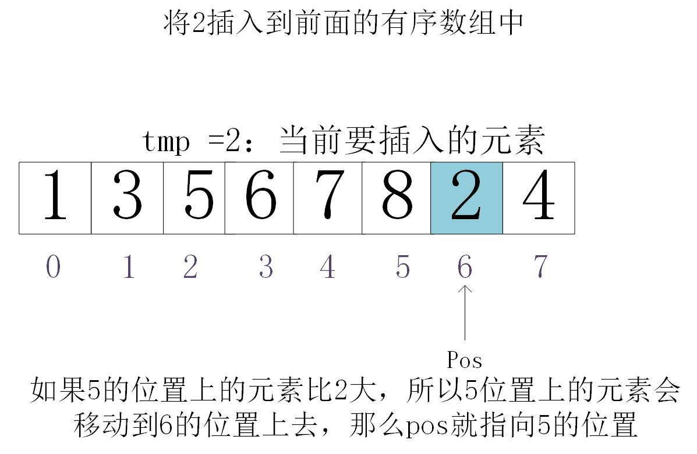

# 算法之插入排序
## 概念
从无序数组中的数据依此插入到有序数组中，直到有序数组为空

## 核心
在有序数组中**找**到即将插入元素的位置



## 代码
插入一个数字到有序数组中去
```java
class Test{
    public void find(){
        int[] x = {1,3,5,6,7,8,2,4};
        int pos = 6;
        int value = x[pos];
        for(int i=pos-1; i>=0; i--){
            if(value < x[i]){
                  x[i+1] = x[i];
                  pos = i;      
            }else{
                // 弄明白break的时候，pos指向哪个位置才是关键
                break;
            }

        }
        x[pos] = value;
    }
}
```