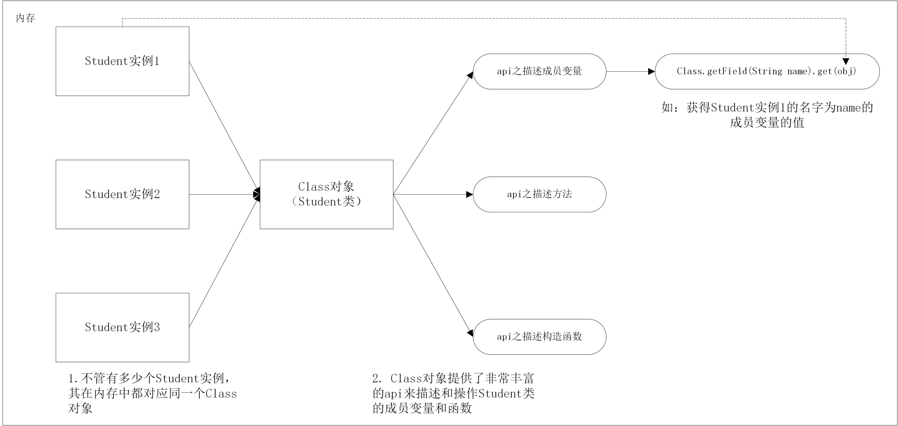

# java之反射
反射提供了一种手段，使得java程序在运行时可以得知一个类自身的信息。

反射会将一个类中的方法，成员变量都会映射成对应的对象（Field对象，Method对象），这些对象提供了丰富的api来操作类中的成员变量，方法。
## 1. 静态编译与动态编译的异同
1. 静态编译不够灵活但是效率高
2. 动态编译灵活但是效率不是非常高（有点类似c语言中的链接）
## 2. Class类--java.lang.Class
类Class的实例表示正在运行的Java应用程序中的类和接口。
>Instances of the class Class represent classes and interfaces in a running Java application. 

获得类Class实例的三种方法
1. Class c = Person.class;
2. Class c = new Person().getClass();
3. Class c = Class.forName("Person");

Class类的常见方法：

方法 | 返回值 | 描述
------------ | ------------- | ------------- 
forName(String className) | Class<?> | 返回指定className的class对象
getDeclaredField(String name) | Field | 返回类中名称为name的Field对象
getDeclaredFields() | Field[] | 返回类中所有的name字段
getDeclaredMethod(String name, Class<?>... parameterTypes) | Method | 返回类中指定方法名和参数的Method对象
getDeclaredMethods() | Method[] | 返回类中所有的Method对象

## 3. 反射相关操作
一切皆为对象，即一个类的方法，字段，构造构造方法都有对应的类
1. java.lang.reflect.Method
2. java.lang.reflect.Field
##### 1. java.lang.reflect.Method
Method类主要用于描述一个类的方法，其具体如下方法（未列全）

方法 | 返回值 | 描述
------------ | ------------- | ------------- 
getName() | String | 获得方法的名字
getReturnType() | Class<?> | 获得方法返回值的Class对象
getTypeParameters() | Class<?>[] | 获得方法的参数的Class对象
invoke(Object obj, Object... args)| object | 在特定目标和参数的情况下，激活方法

```java
import java.lang.Class;
import java.lang.reflect.Method;
public  class Solution{
    public static void main(String[] args) throws Exception{
        Xiaomi x1 = new Xiaomi();
        // 获得Xiaomi类的Class对象
        Class c1 = x1.getClass();
        // 实例化
        Object o1 = c1.newInstance();
        // 获得Xiaomi类的ring方法对象
        Method method = c1.getDeclaredMethod("ring", String.class);
        // 打印ring方法的相关信息
        System.out.println(method.toString());
        System.out.println(method.getReturnType().getName());
        Class[] types = method.getParameterTypes();
        for(int i=0; i<types.length; i++){
            System.out.println(types[i].getName());
        }
        method.invoke(o1, "allen");
    }
}
class Xiaomi{
    public void ring(String xx){
        System.out.println(xx + " : xiaomi is ring");
    }
}
//output
//public void Xiaomi.ring(java.lang.String)
//void
//java.lang.String
//allen : xiaomi is ring
```
##### 2. java.lang.reflect.Field
Field类主要用于描述一个类的field，其具体如下方法（未列全）

方法 | 返回值 | 描述
------------ | ------------- | ------------- 
getName() | String | 获得对应成员变量的名称
getType() | Class<?> | 获得变量的类型的Class对象
get(Object) | Object | 返回指定对象上此Field所表示的字段的值。如果值是原始类型，则该值将自动包装在一个对象中。
set(Object obj, Object value)| void | 将此Field对象在指定对象参数上表示的字段设置为指定的新值。

```java
import java.lang.Class;
import java.lang.reflect.Field;
public  class Solution{
    public static void main(String[] args) throws Exception{
        Xiaomi x1 = new Xiaomi();
        // 获得Xiaomi类的Class对象
        Class c1 = x1.getClass();
        // 获得Xiaomi类的boss字段
        Field field = c1.getField("boss");
        // 获取特定实例上boss字段的值
        System.out.println(field.get(x1));
        // 修改特定实例上boss字段的值
        field.set(x1, "da niu");
        // 查看是否修改成功
        System.out.println(x1.boss);
        System.out.println(field.get(x1));
        // 获得field的名称，以对应的类型
        System.out.println(field.getName()); // field的权限一定要是public的，否则会报出NoSuchFieldException异常
        System.out.println(field.getType().getName());
    }
}
class Xiaomi{
    public String boss = "leijun";
}
//output
//leijun
//da niu
//da niu
//boss
//java.lang.String
```
---



## 4. 反射实战
##### 反射之数据库操作
```java
public class User {
    private int id;
    private String name;
    private String pwd;
    private int age;
    public int getId() {
        return id;
    }
    public void setId(int id) {
        this.id = id;
    }
    public String getName() {
        return name;
    }
    public void setName(String name) {
        this.name = name;
    }
    public String getPwd() {
        return pwd;
    }
    public void setPwd(String pwd) {
        this.pwd = pwd;
    }
    public int getAge() {
        return age;
    }
    public void setAge(int age) {
        this.age = age;
    }
}
```
1. 将一个User对象转变成对应的sql语句
2. 将从sql中查询结果保存到User对象中

[答案](https://mp.weixin.qq.com/s/0fjNYaEWEgxM3F8jZceygw)
## 5. 总结（待续）